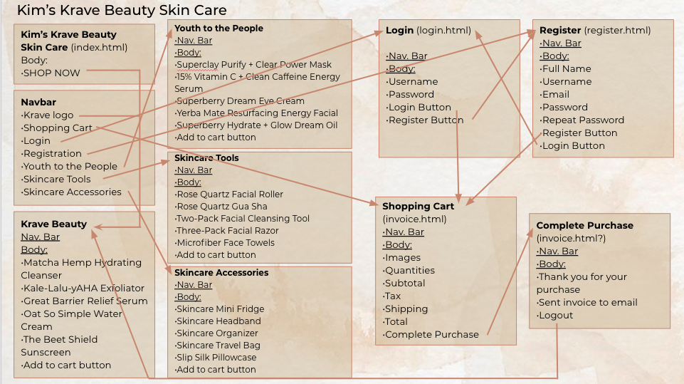

<h2>Kimberly's Checkpoint Assignment 3 Screencast</h2>

<h2>Show what each page will look like. The pages do not have to be “functional” but the design should clear.</h2>

<h2>Describe your design for your site’s shopping cart. That is, will it be a separate page that the user can view and edit, or will it be integrated into the product pages? If so, describe in detail how this will work on your site. Provide several examples of using the cart.</h2>
My shopping cart will be my invoice html. On each products page, after selecting quantities, the user can click add to cart on  those quantities will be accessible in the shopping cart (invoice.html). On all of my product pages, there will be a navbar. In the navbar, there will be an area for the user to click and they will be redirected to the shopping cart (invoice.html). Once they view the shopping cart, the user will be able view and edit the items in their shopping cart. When they're on the shopping cart page they can also go back to any of the product pages using the nav bar or they can complete their purchase by clicking the "Complete purchase" button.

<h2>Explain specifically how you will use sessions to manage your shopping cart. In particular, what shopping cart data will be stored in the session, what data format will be used (NOT what data type, but the format like with the data format used for your registration data). Use code examples showing what data structures (such as arrays and their objects) you will use to manage the shopping cart data and how they will be used in a session.</h2>
I will use sessions to manage the quantity data that the user inputs and save it via the session. Within the session, there are a few things that I will make it store such as: the product type which relates to what page of products they were on and which array of products using the product key, the index of the product selected will also be stored on the session so I know which product they selected, and also the product quantity that the user requested.

<h2>How will you avoid access to your application when the user has not logged in or registered? What are the particular security concerns you must address?</h2>
I have not yet gotten to this step; however, I plan to have the user able to view their shopping cart without having to login or register; however, when they click the "complete purchase" button on the shopping cart page (invoice.html), there will be an alert saying they must login or register before completing their order. To do so, I plan to use cookies. When they log in or register, I will give them a cookie. If they try to complete their order, I will request that cookie, and if they have it I will send them to the complete purchase action, but if they do not have that cookie, I will redirect to the login page. Some possible security concerns I must address is that if I save the user data in a cookie, the user might be able to access and change certain data information in the user data.

<h2>Upon a successful login, how do you provide personalization in your UI? Explain how you did or will do this (paste code if necessary)</h2>
After a user successfully logs in, I will have my application greet and thank the user by name for their purchase. Then, I will also include a part which states that the invoice will be sent to that specific user's email.

<h2>If you are working with partners, how will you split up the work in your team so that you are working in parallel as effectively as possible? That is, who is doing what and when?</h2>
I am working on assignment 3 by myself.

<h2>How are you approaching Assignment 3 differently than Assignment 2?</h2>
I am approaching Assignment 3 differently by taking more time to think about what I would like to do before I do anything else. I think trying to figure out what I wanted to do along the way took a lot more time for assignment 2 because I wasn't exactly sure what I wanted my application to do. However, now I am spending the time to thoroughly think about what I want to do and how it will work before I even get started with trying to add code. Once I fully (or mostly) know what I want, then I'll start thinking about how to do that and then I will try it. 
